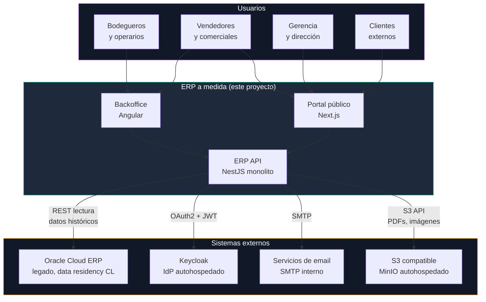
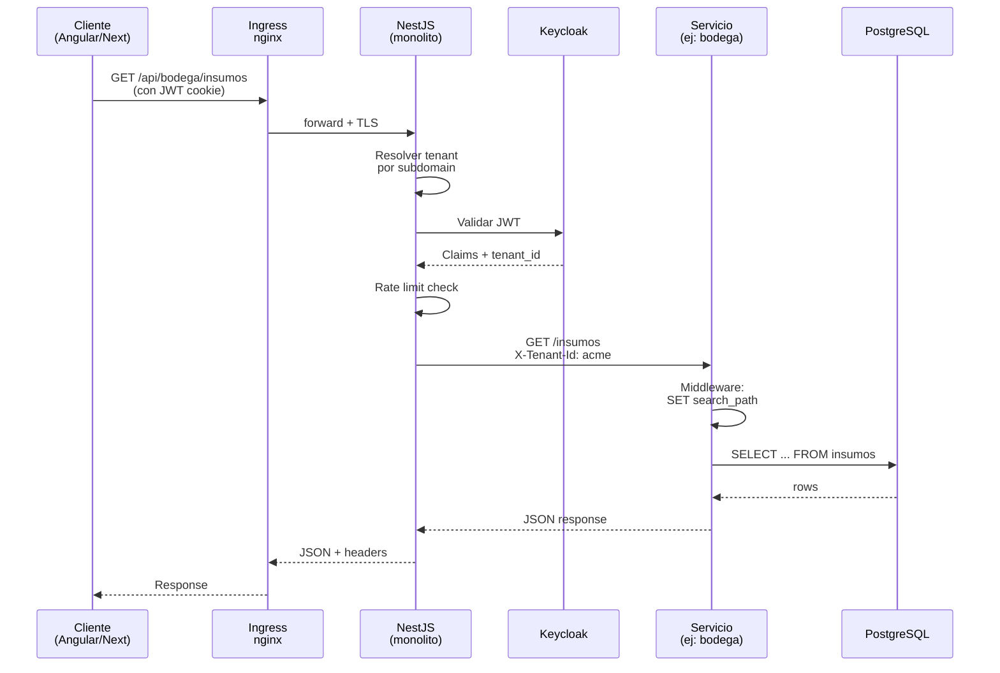
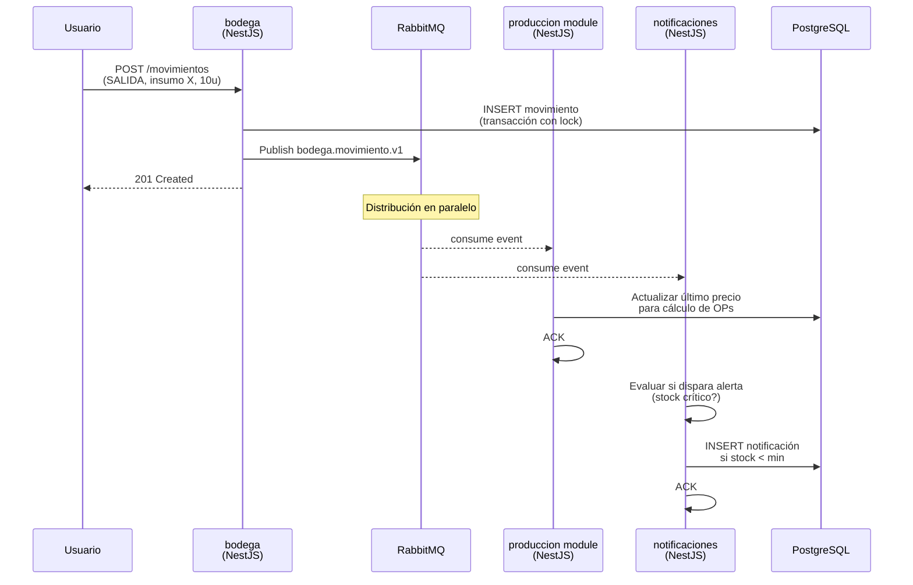
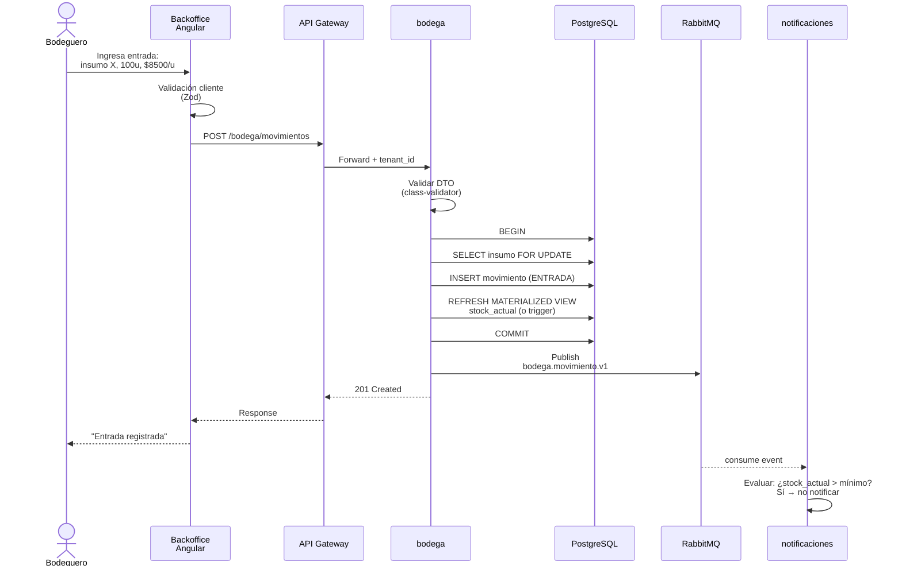
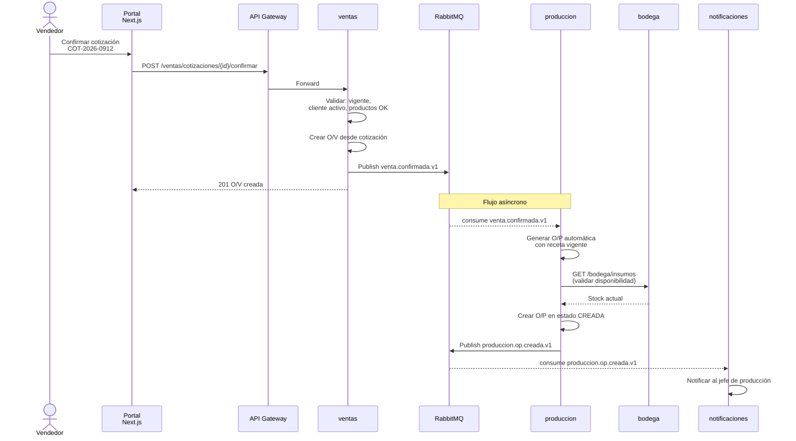
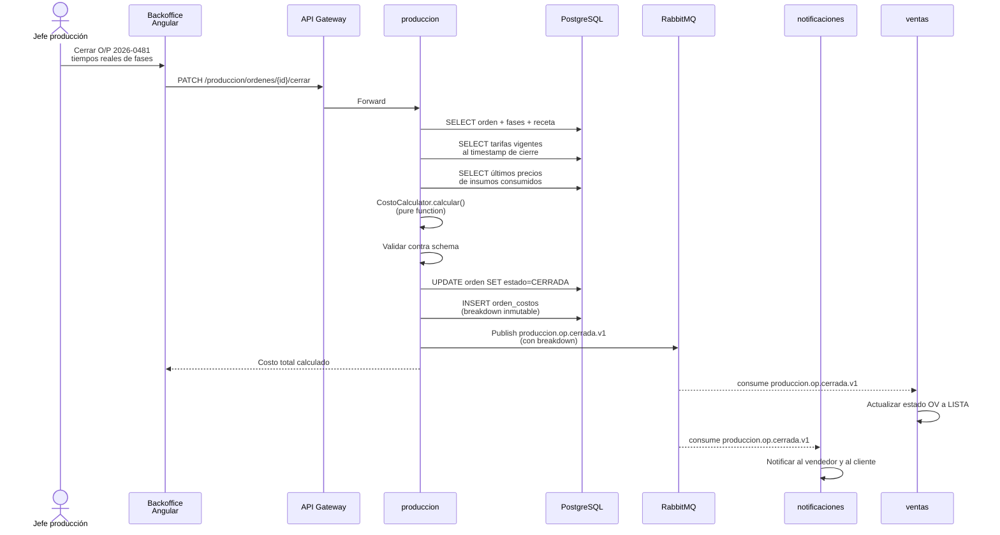

# Arquitectura del ERP

> Vista integral del sistema. Este documento describe **cómo las piezas se conectan**, no **qué tecnología se usa** (eso vive en [`stack.md`](stack.md)) ni **por qué** se tomó cada decisión (eso vive en [`adrs/`](adrs/)).

---

## Tabla de contenidos

- [Introducción](#introducción)
- [Vista de contexto](#vista-de-contexto) — el ERP en su entorno
- [Vista de containers](#vista-de-containers) — servicios y comunicación
- [Vista de datos](#vista-de-datos) — schemas y multi-tenancy
- [Vista de runtime](#vista-de-runtime) — qué pasa durante un request
- [Vista de despliegue](#vista-de-despliegue) — Kubernetes y ambientes
- [Flujos críticos end-to-end](#flujos-críticos-end-to-end)
- [Trade-offs y decisiones abiertas](#trade-offs-y-decisiones-abiertas)

---

## Introducción

### Qué es este sistema

Un ERP industrial a medida que reemplaza el uso actual de Excel + Oracle Cloud ERP en una empresa con 8 años de operación. Gestiona bodega, producción, ventas, cotizaciones, dashboards y, a futuro, RR.HH., leasing y marketing.

### Principios arquitectónicos

Cuatro principios guían todas las decisiones del sistema:

1. **Bounded contexts fuertes.** Cada dominio de negocio vive en su propio servicio con su propia BD. Ver [ADR-001](adrs/ADR-001-microservicios-por-dominio.md).
2. **Los datos monetarios son sagrados.** El motor de costos se valida contra Excel real del cliente y no puede mergearse si falla. Ver [ADR-008](adrs/ADR-008-excel-validation-como-guardrail.md).
3. **Historial inmutable.** Stock, movimientos y tarifas se preservan para reconstrucción del pasado. Ver [ADR-005](adrs/ADR-005-stock-calculado-desde-movimientos.md) y [ADR-007](adrs/ADR-007-tarifas-temporales.md).
4. **Preparado para escalar.** Multi-tenancy desde el día uno permite crecer a otros rubros sin rearquitectura. Ver [ADR-003](adrs/ADR-003-multi-tenancy-por-schema.md).

### Niveles de abstracción usados

Este documento sigue el modelo **C4** (Context, Containers, Components) adaptado al proyecto. Cada vista responde una pregunta distinta — no hay una vista única que muestre todo.

---

## Vista de contexto

Qué sistemas rodean al ERP y cómo interactúan con él.



### Lo importante de esta vista

- **Oracle Cloud ERP no se reemplaza el día uno.** Coexiste durante 6-12 meses. El ERP nuevo lo consume en modo lectura vía REST Adapter para datos históricos relevantes. Agente responsable: A1 con ticket T-049.
- **Keycloak es autohospedado.** No usamos Auth0 ni Cognito por requisitos de data residency del cliente. Ver [ADR rechazado en stack.md](stack.md#por-qué-keycloak-y-no-auth0).
- **No hay otros sistemas externos en el MVP.** Pagos, facturación electrónica, logística vendrán en módulo 2 o 3.

---

## Vista de containers

Los servicios que componen el ERP y cómo se comunican entre sí.

```mermaid
graph LR
    subgraph Clientes["Capa cliente"]
        WEB[Next.js<br/>Portal público]
        BACK[Angular<br/>Backoffice]
    end

    subgraph Monolito["erp-api · NestJS Monolito"]
        AUTH[auth module<br/>usuarios, roles, JWT]
        BOD[bodega module<br/>insumos, movimientos]
        VEN[ventas module<br/>clientes, cotiz, OVs]
        PRO[produccion module<br/>recetas, OPs, costos]
        NOT[notificaciones module<br/>alertas, emails]
        EVT[EventEmitter2<br/>bus de eventos interno]
    end

    subgraph Datos["Capa de datos"]
        PG[(PostgreSQL<br/>multi-schema)]
        RD[(Redis<br/>cache, jobs)]
        S3[(MinIO<br/>archivos)]
    end

    WEB --> Monolito
    BACK --> Monolito

    BOD -.->|emit| EVT
    VEN -.->|emit| EVT
    PRO -.->|emit| EVT
    EVT -.->|@OnEvent| PRO
    EVT -.->|@OnEvent| NOT

    AUTH --> PG
    BOD --> PG
    VEN --> PG
    PRO --> PG
    NOT --> PG

    AUTH --> RD
    BOD --> RD
    NOT --> RD

    VEN --> S3
    PRO --> S3

    style Clientes fill:#1e293b,stroke:#5b8fff
    style Monolito fill:#1e293b,stroke:#00d4aa
    style Datos fill:#1e293b,stroke:#ff5577
```

> **Nota:** los módulos viven en un solo proceso NestJS. La comunicación interna usa `EventEmitter2` con el mismo formato de payload que usaríamos con RabbitMQ. Cuando un módulo se extraiga como microservicio (ver `docs/roadmap-microservicios.md`), solo cambia el transporte, no la lógica.

### Catálogo de servicios

| Módulo | Stack | Agente | Responsabilidad | Emite eventos | Consume eventos |
|---|---|---|---|---|---|
| `auth` | NestJS + Prisma | A1 | Auth, usuarios, roles | `auth.login` | — |
| `bodega` | NestJS + Prisma | A1 | Insumos, categorías, movimientos, stock | `bodega.movimiento.registrado`, `bodega.stock_critico.alcanzado` | — |
| `ventas` | NestJS + Prisma | A1 | Clientes, cotizaciones, O/Vs | `venta.cotizacion.*`, `venta.confirmada` | `bodega.stock_critico.alcanzado` |
| `produccion` | NestJS + Prisma | A1 (futuro A2 en Python) | Productos, recetas, variantes, O/Ps, costos, tarifas | `produccion.op.*`, `produccion.tarifa.cambiada` | `bodega.movimiento.registrado`, `venta.confirmada` |
| `notificaciones` | NestJS + BullMQ | A1 | Alertas, emails, push, centro de notificaciones | — | Todos los eventos de los demás |

> Todos los módulos viven en `services/erp-api/src/modules/` y comparten el mismo `prisma/schema.prisma`.

### Reglas de comunicación

- **Síncrona entre módulos:** un módulo invoca el servicio público de otro módulo (declarado en `exports` del NestJS module).
- **Asíncrona entre módulos:** `EventEmitter2` con `@OnEvent()` cuando no se necesita respuesta inmediata.
- **Síncrona desde clientes:** Next.js/Angular → REST API del monolito.
- **Prohibido:** un módulo nunca accede directamente a tablas/repositorios de otro módulo. Siempre vía servicio público o evento. Ver [ADR-010](adrs/ADR-010-monolito-modular.md).
- **Futuro (microservicios):** `EventEmitter2` se reemplaza por RabbitMQ con el mismo formato de payload. Ver `docs/roadmap-microservicios.md`.

---

## Vista de datos

Cómo se organizan los datos en PostgreSQL considerando multi-tenancy.

### Estructura general

```mermaid
graph TB
    subgraph PG["PostgreSQL (una instancia)"]
        subgraph PUB["schema: public"]
            P1[tenants]
            P2[usuarios_globales]
            P3[auditoria_global]
        end

        subgraph T1["schema: tenant_acme"]
            A1[insumos]
            A2[movimientos_bodega]
            A3[ordenes_produccion]
            A4[tarifas]
            A5[clientes]
            A6[cotizaciones]
            A7[ordenes_venta]
            A8[usuarios]
        end

        subgraph T2["schema: tenant_beta"]
            B1[insumos]
            B2[movimientos_bodega]
            B3[ordenes_produccion]
            B4[...]
        end

        subgraph T3["schema: tenant_erp"]
            D1[...]
        end
    end

    style PG fill:#0f172a,stroke:#00d4aa
    style PUB fill:#1e293b,stroke:#c47de0
    style T1 fill:#1e293b,stroke:#00d4aa
    style T2 fill:#1e293b,stroke:#5b8fff
    style T3 fill:#1e293b,stroke:#f59e0b
```



### Distribución de tablas por servicio

Cada servicio es dueño de un subconjunto de tablas dentro del schema del tenant. Los servicios **nunca** leen directamente tablas de otro servicio.

| Servicio | Tablas principales | Tablas de apoyo |
|---|---|---|
| `core` | `usuarios`, `roles`, `usuarios_roles` | `sesiones`, `auditoria_auth` |
| `bodega` | `insumos`, `categorias`, `movimientos_bodega` | `unidades_medida` |
| `ventas` | `clientes`, `cotizaciones`, `ordenes_venta` | `tipos_cobro`, `condiciones_comerciales` |
| `produccion` | `productos`, `recetas`, `variantes`, `ordenes_produccion`, `fases_produccion`, `tarifas`, `orden_costos` | `maquinas`, `tipos_trabajador` |
| `notificaciones` | `notificaciones`, `canal_usuario` | `plantillas_mensaje` |

### Detalle del schema `public`

La única BD con datos que cruzan tenants. Contiene:

- **`tenants`** — catálogo de tenants activos: `(id, nombre, active, created_at, config_jsonb)`
- **`usuarios_globales`** — (opcional, para admin del ERP) usuarios que pueden ver métricas globales sin pertenecer a un tenant específico.
- **`auditoria_global`** — registro de eventos cross-tenant como creación de tenants, cambios de configuración global.

Ver detalles en [ADR-003](adrs/ADR-003-multi-tenancy-por-schema.md).

### Patrón de entidades con historial inmutable

Dos dominios centrales usan este patrón (ver [ADR-005](adrs/ADR-005-stock-calculado-desde-movimientos.md) y [ADR-007](adrs/ADR-007-tarifas-temporales.md)):

```
┌─────────────────────────────────────────────────────┐
│ Stock de insumos                                    │
│                                                     │
│  insumos                movimientos_bodega          │
│  ┌──────────┐           ┌────────────────────┐      │
│  │ id       │◄──────────│ insumo_id          │      │
│  │ codigo   │           │ tipo (ENTRADA/...) │      │
│  │ nombre   │           │ cantidad           │      │
│  │ min_stock│           │ precio_unitario    │      │
│  └──────────┘           │ created_at         │      │
│       ▲                 └────────────────────┘      │
│       │                        (inmutable)          │
│       │                                             │
│  stock_actual (vista materializada)                 │
│  = SUM(entradas - salidas) por insumo               │
└─────────────────────────────────────────────────────┘

┌─────────────────────────────────────────────────────┐
│ Tarifas con vigencia temporal                       │
│                                                     │
│  tarifas                                            │
│  ┌─────────────────────────────────────┐            │
│  │ entidad_tipo (MAQUINA/TRABAJADOR)   │            │
│  │ entidad_id                          │            │
│  │ valor_por_minuto                    │            │
│  │ valid_from                          │            │
│  │ valid_to (null = vigente)           │            │
│  │ created_at                          │            │
│  └─────────────────────────────────────┘            │
│       (tarifas con valid_to ≠ null son inmutables)  │
└─────────────────────────────────────────────────────┘
```

### Campos dinámicos con JSONB

Los atributos que varían por categoría de producto viven en columnas JSONB validadas contra JSON Schema. Ver [ADR-004](adrs/ADR-004-jsonb-para-campos-dinamicos.md).

```sql
-- Ejemplo simplificado
CREATE TABLE variantes_producto (
  id uuid PRIMARY KEY,
  producto_id uuid NOT NULL REFERENCES productos(id),
  atributos jsonb NOT NULL,  -- valida contra schema de su categoría
  ...
);

CREATE INDEX idx_variantes_atributos
  ON variantes_producto USING GIN (atributos);
```

---

## Vista de runtime

Cómo se procesa un request típico desde que entra hasta que vuelve.

### Request HTTP síncrono



**Tiempos esperados (objetivos):**
- p50: < 150ms
- p95: < 400ms
- p99: < 800ms

Si un endpoint excede p95 de 400ms sostenido, se analiza en la ceremonia de observabilidad semanal.

### Flujo asíncrono con eventos



**Garantías:**
- At-least-once delivery (los consumers son idempotentes).
- ACK manual después de procesar con éxito.
- Si un consumer falla 3 veces, el mensaje va a DLQ (dead letter queue).

Ver [ADR-006](adrs/ADR-006-rabbitmq-para-mensajeria.md) y `docs/events.md` (pendiente).

### Manejo de errores y rollback

| Tipo de error | Respuesta del sistema |
|---|---|
| 4xx validación | Respuesta inmediata al cliente, no hay cambios en BD |
| 5xx interno | Rollback de transacción, log a Sentry, métrica a Prometheus |
| Error en consumer de evento | Nack, retry (backoff), DLQ tras 3 fallos |
| Deploy que rompe métricas | Rollback automático por ArgoCD (ver vista de despliegue) |

---

## Vista de despliegue

Cómo se hostea todo en Kubernetes (AWS EKS).

### Ambientes

```
┌──────────────┐      ┌──────────────┐      ┌──────────────┐
│   local      │      │   staging    │      │  production  │
│              │      │              │      │              │
│ docker-      │─────►│ EKS cluster  │─────►│ EKS cluster  │
│ compose      │      │ us-east-1    │      │ us-east-1    │
│              │      │ namespace:   │      │ namespace:   │
│ todos los    │      │ erp-staging  │      │ erp-prod     │
│ servicios +  │      │              │      │              │
│ BD local     │      │ 1 RDS        │      │ 1 RDS (Multi-│
│              │      │ 1 Redis      │      │ AZ)          │
│              │      │ 1 RabbitMQ   │      │ 1 Redis cluster │
│              │      │              │      │ 3 RabbitMQ   │
└──────────────┘      └──────────────┘      └──────────────┘
```

### Topología en producción

```mermaid
graph TB
    subgraph AWS["AWS us-east-1"]
        subgraph VPC["VPC"]
            subgraph Public["Public subnets"]
                ALB[Application<br/>Load Balancer]
            end

            subgraph Private["Private subnets"]
                subgraph EKS["EKS cluster"]
                    subgraph NSApp["namespace: erp-prod"]
                        I[nginx-ingress]
                        G[erp-api<br/>NestJS monolito]
                        S1[bodega<br/>3 replicas]
                        S2[ventas<br/>3 replicas]
                        S3[produccion<br/>3 replicas]
                        S4[notificaciones<br/>2 replicas]
                        S5[core<br/>2 replicas]
                        W1[web-public<br/>3 replicas]
                        W2[web-backoffice<br/>2 replicas]
                    end

                    subgraph NSInfra["namespace: infra"]
                        K[Keycloak]
                        R[RabbitMQ<br/>3 nodos]
                        PR[Prometheus]
                        GR[Grafana]
                        LO[Loki]
                        AR[ArgoCD]
                    end
                end

                subgraph DBs["Managed services"]
                    RDS[(RDS PostgreSQL<br/>Multi-AZ)]
                    EC[(ElastiCache<br/>Redis cluster)]
                end

                subgraph Storage["S3"]
                    S3B[bucket:<br/>erp-files]
                    S3BK[bucket:<br/>erp-backups]
                end
            end
        end
    end

    ALB --> I
    I --> G
    G --> S1
    G --> S2
    G --> S3
    G --> S4
    G --> S5
    G --> W1
    G --> W2

    S1 --> RDS
    S2 --> RDS
    S3 --> RDS
    S4 --> RDS
    S5 --> RDS
    S1 --> EC
    S4 --> EC
    S2 --> S3B
    S3 --> S3B
    RDS -.backup.-> S3BK

    S1 -.eventos.-> R
    S2 -.eventos.-> R
    S3 -.eventos.-> R
    S4 -.eventos.-> R

    style AWS fill:#0f172a,stroke:#f59e0b
    style EKS fill:#1e293b,stroke:#00d4aa
    style NSApp fill:#1e293b,stroke:#5b8fff
    style NSInfra fill:#1e293b,stroke:#c47de0
    style DBs fill:#1e293b,stroke:#ff5577
```



### Pipeline de despliegue

```mermaid
graph LR
    DEV[Desarrollador<br/>commit a rama] --> PR[Pull Request]
    PR --> CI1[CI: lint, test, build]
    CI1 --> REV[Review humano]
    REV --> MG[Merge a main]
    MG --> CI2[CI: build imagen Docker]
    CI2 --> REG[Push a ECR]
    REG --> ARGO[ArgoCD detecta cambio]
    ARGO --> STG[Deploy a staging]
    STG --> E2E[Tests E2E + smoke]
    E2E --> APR{¿Aprobar<br/>producción?}
    APR -->|sí, manual| PRD[Deploy a producción]
    APR -->|no| END[Queda en staging]
    PRD --> MON[Monitor 5 min]
    MON --> RB{¿Métricas<br/>OK?}
    RB -->|no| AUTO[Rollback<br/>automático]
    RB -->|sí| DONE[Deploy OK]

    style DEV fill:#1e293b,stroke:#c47de0
    style REV fill:#1e293b,stroke:#c47de0
    style APR fill:#1e293b,stroke:#f59e0b
    style AUTO fill:#7f1d1d,stroke:#ff5577
    style DONE fill:#064e3b,stroke:#00d4aa
```



**Guardrails del pipeline:**
- Branch protection en `main` y `staging`.
- CI verde obligatorio (incluye test de fixture Excel para costos — ver [ADR-008](adrs/ADR-008-excel-validation-como-guardrail.md)).
- Al menos 1 aprobación humana.
- Deploy a staging automático; deploy a producción requiere aprobación manual.
- Rollback automático si métricas de error >5% durante 5 minutos post-deploy.

### Observabilidad

Tres pilares, uno por cada tipo de señal:

| Pilar | Herramienta | Qué captura | Consultable en |
|---|---|---|---|
| Métricas | Prometheus + Grafana | Latencia, throughput, saturación, errores | Dashboards Grafana |
| Logs | Loki | Logs estructurados JSON de cada pod | Grafana Explore |
| Errores | Sentry | Stack traces, contexto del request, usuario | Sentry UI |
| Tracing | OpenTelemetry | Traces entre servicios | Jaeger (opcional) |

Dashboards críticos que siempre existen:

- **Overview general:** salud de cada servicio, error rate, latencia p50/p95/p99.
- **Bodega:** movimientos/min, alertas de stock crítico.
- **Producción:** OPs abiertas, cerradas, costos calculados, comparación con fixture Excel.
- **RabbitMQ:** profundidad de colas, mensajes en DLQ.
- **BD:** conexiones activas, slow queries, replication lag.

---

## Flujos críticos end-to-end

Los 3 casos de uso más importantes del sistema, de principio a fin.

### Flujo 1: Bodeguero registra entrada de insumos



**Invariantes que se respetan:**
- Stock no negativo (validación en el SELECT FOR UPDATE).
- Movimiento inmutable (no hay UPDATE de movimientos).
- Evento emitido para consumo posterior.

### Flujo 2: Vendedor confirma O/V que dispara producción



**Invariantes que se respetan:**
- La O/V queda "pegada" a la cotización (inmutable una vez confirmada).
- La O/P se crea con la versión de receta vigente al momento (ver [ADR-007](adrs/ADR-007-tarifas-temporales.md)).
- Eventos versionados (`.v1`) permiten evolución futura.

### Flujo 3: Cerrar O/P y calcular costo real



**Invariantes críticos que se respetan:**
- El cálculo usa tarifas vigentes **al cierre**, no las actuales ([ADR-007](adrs/ADR-007-tarifas-temporales.md)).
- El resultado pasa por el test del fixture Excel antes del merge ([ADR-008](adrs/ADR-008-excel-validation-como-guardrail.md)).
- El breakdown se persiste inmutable en `orden_costos`.
- El cálculo es pure function, sin efectos secundarios que lo hagan no-determinístico.

---

## Trade-offs y decisiones abiertas

Áreas donde la arquitectura tiene compromisos conscientes, o donde hay decisiones pendientes.

### Trade-offs aceptados

| Compromiso | Por qué lo aceptamos | Mitigación |
|---|---|---|
| Latencia adicional por microservicios | Bounded contexts claros, escalabilidad | Caching, llamadas paralelas cuando posible |
| Complejidad operativa (K8s, RabbitMQ, múltiples servicios) | Escalabilidad multi-tenant multi-rubro | Agente A7 encapsula complejidad en Helm |
| Migraciones a ejecutar por tenant | Aislamiento fuerte | Script automatizado en CI |
| Sin replay histórico de eventos | RabbitMQ suficiente para el volumen | Eventos también se persisten en BD, replay via queries |
| Un solo stack (NestJS) en monolito modular | Velocidad de desarrollo, simplicidad operativa | Módulos extractables cuando crezca el negocio |

### Decisiones abiertas (pendientes)

Cosas que no se han decidido y que se resolverán en futuros ADRs:

1. **Estrategia de facturación electrónica** (módulo 2). Integraciones regionales específicas.
2. **Estrategia de sincronización con Oracle Cloud ERP** más allá de lectura. Si algún día hay que escribir en Oracle, cómo se hace.
3. **Arquitectura del módulo de analytics** (proyecciones, forecasting). Podría requerir ClickHouse o TimescaleDB como en [stack.md](stack.md).
4. **Cómo manejar disaster recovery multi-región.** Hoy es single-region con backups. Cuando el cliente crezca puede hacerse multi-región.
5. **Estrategia de IA en producto** (vs IA en desarrollo, que ya está resuelta con ADR-009). Por ejemplo, ¿sugerencias inteligentes de precios? ¿Detección de anomalías en stock? Por ahora no hay alcance.

### Cuándo actualizar este documento

Este documento se revisa en:

- **Cambio de fase** del proyecto (fin de MVP, inicio de módulo 2).
- **Cuando se acepta un ADR nuevo** que cambia alguna vista.
- **Cuando se suma un servicio nuevo** al sistema.
- **Cada 3 meses** en ceremonia de arquitectura dedicada.

Los diagramas Mermaid están en el propio archivo y son modificables con un PR normal.

---

## Referencias cruzadas

- [Stack tecnológico](stack.md) — qué tecnologías específicas se usan.
- [Glosario](glossary.md) — terminología de negocio.
- [ADRs](adrs/README.md) — decisiones justificadas.
- [Contratos de agentes](../agents/README.md) — quién es dueño de qué.
- [Dashboard visual](../dashboard/erp_agentes_ia.html) — panel operativo.
- [Prompts por ticket](../prompts/README.md) — cómo se ejecutan las tareas.

---

**Versión:** 1.0
**Mantenedor:** Tech Lead
**Última actualización:** abril 2026
**Frecuencia de revisión:** trimestral o por cambio de fase
