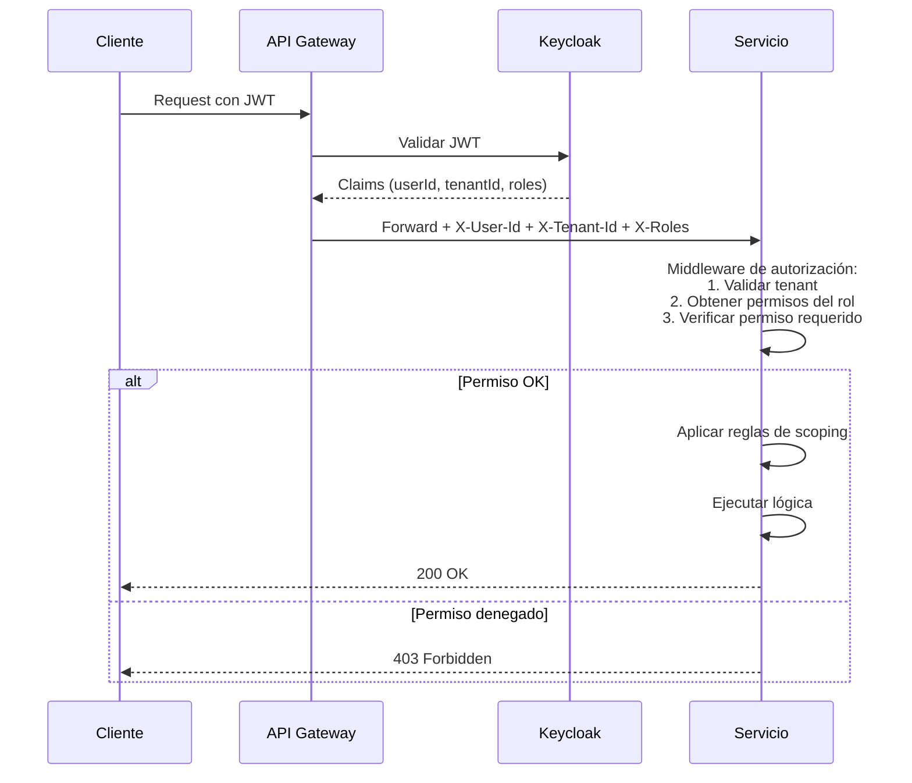

# Matriz RBAC

> Fuente única de verdad sobre roles, permisos y reglas de autorización del ERP. Todo endpoint, toda vista, toda acción debe estar cubierta por una regla documentada aquí.

---

## Tabla de contenidos

- [Modelo conceptual](#modelo-conceptual)
- [Catálogo de roles](#catálogo-de-roles)
- [Catálogo de permisos atómicos](#catálogo-de-permisos-atómicos)
- [Matriz rol × permiso](#matriz-rol--permiso)
- [Reglas de autorización complejas](#reglas-de-autorización-complejas)
- [Implementación técnica](#implementación-técnica)
- [Operación del RBAC](#operación-del-rbac)
- [Casos edge](#casos-edge)

---

## Modelo conceptual

### Separación autenticación vs autorización

- **Autenticación** (quién eres): la resuelve **Keycloak**. Emite un JWT con claims del usuario.
- **Autorización** (qué puedes hacer): la resuelve cada **servicio** usando este documento como referencia, aplicando el JWT recibido.

Keycloak nunca sabe qué puede hacer un usuario en cada servicio. Los servicios nunca saben cómo se autenticó. Esta separación es deliberada.

### Entidades del modelo

```
┌──────────────┐     ┌──────────────┐     ┌──────────────┐
│   Usuario    │─N:M─│     Rol      │─N:M─│   Permiso    │
└──────────────┘     └──────────────┘     └──────────────┘
       │                    │                     │
       │                    │                     │ aplica a
       │                    │                     ▼
       │                    │              ┌──────────────┐
       │                    │              │   Recurso    │
       │                    │              │  (servicio/  │
       │                    │              │  entidad)    │
       │                    │              └──────────────┘
       │
       │ pertenece a
       ▼
┌──────────────┐
│    Tenant    │
└──────────────┘
```

- **Usuario** — persona física con credenciales en Keycloak.
- **Rol** — conjunto nombrado de permisos. Ej: `jefe-produccion`, `bodeguero`.
- **Permiso** — acción atómica sobre un recurso. Ej: `bodega:insumo:crear`.
- **Recurso** — entidad del dominio sobre la que se aplica un permiso.
- **Tenant** — empresa/rubro. Un usuario pertenece a **uno** o más tenants.

### Formato de permisos

```
{dominio}:{entidad}:{accion}
```

Ejemplos:
- `bodega:insumo:crear`
- `bodega:insumo:leer`
- `produccion:op:cerrar`
- `ventas:cotizacion:aprobar`

Acciones estándar:
- `leer` — ver detalle y listados
- `crear` — crear nuevo
- `modificar` — editar existente
- `eliminar` — soft-delete
- `aprobar` — transiciones de estado que requieren aprobación
- Acciones específicas cuando el dominio lo amerita (`cerrar`, `cancelar`, `publicar`).

---

## Catálogo de roles

Los 9 roles del MVP. Cada uno incluye: quién lo tiene, qué puede hacer a grandes rasgos, y restricciones especiales.

### `admin-sistema`

**Quién lo tiene:** el administrador técnico del ERP (típicamente 1-2 personas por tenant, o del proveedor del software).

**Descripción:** acceso completo dentro del tenant. Puede configurar roles, crear usuarios, ajustar parámetros del sistema. No puede ver datos de otros tenants.

**Asignación:** manual, requiere aprobación de Tech Lead + contraparte del cliente.

**Restricciones:** no tiene acceso a configuración cross-tenant (eso es `super-admin`, fuera del MVP).

---

### `gerencia`

**Quién lo tiene:** directores, gerentes generales, CEO del cliente.

**Descripción:** solo lectura sobre todos los dominios. Acceso completo a dashboards, reportes, consolidados. No puede modificar datos operativos.

**Asignación:** manual, asignada por el `admin-sistema`.

**Restricciones:** explícitamente **read-only** en todo el sistema. Si un gerente necesita hacer una operación (ej: aprobar una cotización grande), se le asigna un rol adicional temporal.

---

### `admin-bodega`

**Quién lo tiene:** jefe de bodega, encargado de inventario.

**Descripción:** control completo del módulo de bodega. CRUD de insumos, categorías, registrar movimientos de cualquier tipo, hacer ajustes por inventario físico.

**Asignación:** por `admin-sistema`.

**Restricciones:** no puede ver datos de ventas ni producción salvo lo que aparece en el dashboard general.

---

### `bodeguero`

**Quién lo tiene:** operarios de bodega del día a día.

**Descripción:** registrar movimientos de entrada y salida, ver insumos. No puede crear/modificar/eliminar insumos ni categorías ni hacer ajustes.

**Asignación:** por `admin-sistema` o `admin-bodega`.

**Restricciones:** los ajustes (`AJUSTE_POSITIVO`, `AJUSTE_NEGATIVO`) requieren rol `admin-bodega`. Un bodeguero no puede corregir discrepancias de inventario por su cuenta.

---

### `jefe-produccion`

**Quién lo tiene:** jefe de producción, ingeniero a cargo de manufactura.

**Descripción:** control completo del módulo de producción. Crear y modificar recetas, crear O/Ps, definir tarifas, cerrar O/Ps.

**Asignación:** por `admin-sistema`.

**Restricciones crítica:** **los cambios de tarifas tienen auditoría reforzada** (ver [ADR-007](adrs/ADR-007-tarifas-temporales.md)). Solo este rol (y `admin-sistema`) puede hacerlo, y queda registrado con motivo obligatorio.

---

### `operario-produccion`

**Quién lo tiene:** operarios que ejecutan fases de las O/Ps.

**Descripción:** ver O/Ps asignadas, actualizar el estado de las fases donde están asignados (iniciar, registrar tiempo, finalizar). No pueden crear O/Ps ni modificar recetas.

**Asignación:** por `admin-sistema` o `jefe-produccion`.

**Restricciones:** solo pueden modificar fases donde están asignados como ejecutores. No pueden ver costos calculados ni tarifas.

---

### `admin-ventas`

**Quién lo tiene:** gerente comercial, jefe de ventas.

**Descripción:** control completo del módulo de ventas. CRUD de clientes, crear/aprobar cotizaciones, crear/cancelar O/Vs, configurar tipos de cobro, ver todas las operaciones del equipo.

**Asignación:** por `admin-sistema`.

---

### `vendedor`

**Quién lo tiene:** miembros del equipo comercial.

**Descripción:** crear cotizaciones para sus clientes asignados, gestionar sus propios clientes, convertir cotizaciones aprobadas en O/Vs.

**Asignación:** por `admin-sistema` o `admin-ventas`.

**Restricciones críticas:**
- Solo puede ver **sus propios clientes** (asignados al vendedor). Ver [reglas de scoping](#regla-5-scoping-por-vendedor).
- No puede configurar tipos de cobro ni condiciones comerciales — eso es `admin-ventas`.
- Cotizaciones sobre un umbral monetario requieren aprobación de `admin-ventas`.

---

### `encargado-compras`

**Quién lo tiene:** responsable de compras a proveedores.

**Descripción:** ver stock crítico, generar órdenes de compra (OC) a proveedores, registrar entradas de bodega cuando llegan las compras.

**Asignación:** por `admin-sistema`.

**Restricciones:** puede registrar movimientos de `ENTRADA` pero no `SALIDA` ni ajustes.

---

## Catálogo de permisos atómicos

Lista completa de permisos del MVP. Sirve como "vocabulario" para construir roles.

### Dominio `auth`

| Permiso | Descripción |
|---|---|
| `auth:usuario:leer` | Ver lista y detalle de usuarios |
| `auth:usuario:crear` | Crear usuarios nuevos |
| `auth:usuario:modificar` | Editar usuarios existentes |
| `auth:usuario:eliminar` | Desactivar usuarios (soft delete) |
| `auth:rol:asignar` | Asignar roles a usuarios |
| `auth:rol:revocar` | Revocar roles de usuarios |
| `auth:propia:modificar` | Editar el propio perfil |

### Dominio `bodega`

| Permiso | Descripción |
|---|---|
| `bodega:insumo:leer` | Ver insumos (listado y detalle) |
| `bodega:insumo:crear` | Crear insumos nuevos |
| `bodega:insumo:modificar` | Editar insumos |
| `bodega:insumo:eliminar` | Soft-delete de insumos |
| `bodega:categoria:leer` | Ver categorías |
| `bodega:categoria:crear` | Crear categorías |
| `bodega:categoria:modificar` | Editar categorías |
| `bodega:categoria:eliminar` | Soft-delete de categorías |
| `bodega:movimiento:leer` | Ver historial de movimientos |
| `bodega:movimiento:registrar-entrada` | Registrar movimientos tipo ENTRADA |
| `bodega:movimiento:registrar-salida` | Registrar movimientos tipo SALIDA |
| `bodega:movimiento:ajustar` | Registrar ajustes positivos/negativos |
| `bodega:stock:consultar` | Ver stock actual de insumos |
| `bodega:reporte:ver` | Ver reportes agregados de bodega |

### Dominio `produccion`

| Permiso | Descripción |
|---|---|
| `produccion:producto:leer` | Ver productos |
| `produccion:producto:crear` | Crear productos |
| `produccion:producto:modificar` | Editar productos |
| `produccion:receta:leer` | Ver recetas |
| `produccion:receta:crear` | Crear nueva versión de receta |
| `produccion:receta:activar` | Activar/desactivar versiones de receta |
| `produccion:variante:leer` | Ver variantes de productos |
| `produccion:variante:gestionar` | Crear, modificar, eliminar variantes |
| `produccion:op:leer` | Ver O/Ps (listado y detalle) |
| `produccion:op:crear` | Crear nueva O/P |
| `produccion:op:modificar-asignaciones` | Asignar máquinas y personal a fases |
| `produccion:op:cerrar` | Cerrar O/P y ejecutar cálculo de costo |
| `produccion:op:cancelar` | Cancelar O/P |
| `produccion:fase:actualizar-estado` | Iniciar/finalizar fases asignadas |
| `produccion:fase:ver-asignadas` | Ver solo las fases donde el usuario está asignado |
| `produccion:tarifa:leer` | Ver tarifas vigentes e históricas |
| `produccion:tarifa:cambiar` | Crear nueva tarifa (cerrar anterior) |
| `produccion:costo:ver` | Ver costos calculados de O/Ps |
| `produccion:reporte:ver` | Ver reportes agregados de producción |

### Dominio `ventas`

| Permiso | Descripción |
|---|---|
| `ventas:cliente:leer-propios` | Ver solo los clientes asignados al usuario |
| `ventas:cliente:leer-todos` | Ver todos los clientes del tenant |
| `ventas:cliente:crear` | Crear cliente nuevo |
| `ventas:cliente:modificar` | Editar cliente |
| `ventas:cliente:asignar-vendedor` | Asignar/reasignar vendedor a cliente |
| `ventas:cotizacion:leer-propias` | Ver solo cotizaciones del usuario |
| `ventas:cotizacion:leer-todas` | Ver todas las cotizaciones |
| `ventas:cotizacion:crear` | Crear cotización |
| `ventas:cotizacion:modificar` | Editar cotización en estado BORRADOR |
| `ventas:cotizacion:enviar` | Pasar cotización a estado ENVIADA |
| `ventas:cotizacion:aprobar` | Pasar a APROBADA (cuando cliente acepta) |
| `ventas:cotizacion:rechazar` | Pasar a RECHAZADA |
| `ventas:ov:leer-propias` | Ver O/Vs del usuario |
| `ventas:ov:leer-todas` | Ver todas las O/Vs |
| `ventas:ov:crear-desde-cotizacion` | Convertir cotización aprobada en O/V |
| `ventas:ov:confirmar` | Confirmar O/V (dispara producción) |
| `ventas:ov:cancelar` | Cancelar O/V |
| `ventas:tipo-cobro:leer` | Ver tipos de cobro |
| `ventas:tipo-cobro:gestionar` | Crear/modificar tipos de cobro |
| `ventas:condicion-comercial:gestionar` | Configurar condiciones por cliente |
| `ventas:reporte:ver` | Ver reportes agregados de ventas |

### Dominio `dashboard`

| Permiso | Descripción |
|---|---|
| `dashboard:operativo:ver` | Dashboard con métricas del día |
| `dashboard:gerencial:ver` | Dashboard ejecutivo con KPIs |
| `dashboard:financiero:ver` | Dashboard con datos monetarios |

### Dominio `configuracion`

| Permiso | Descripción |
|---|---|
| `configuracion:sistema:leer` | Ver parámetros del sistema |
| `configuracion:sistema:modificar` | Modificar parámetros del sistema |
| `configuracion:integracion:gestionar` | Configurar integraciones (Oracle, SMTP, etc.) |

---

## Matriz rol × permiso

La tabla maestra. Columnas = roles, filas = permisos. Marca `✓` = permiso concedido, vacío = denegado.

### Dominio auth

| Permiso | admin-sistema | gerencia | admin-bodega | bodeguero | jefe-produccion | operario-produccion | admin-ventas | vendedor | encargado-compras |
|---|:-:|:-:|:-:|:-:|:-:|:-:|:-:|:-:|:-:|
| `auth:usuario:leer` | ✓ | ✓ | | | | | | | |
| `auth:usuario:crear` | ✓ | | | | | | | | |
| `auth:usuario:modificar` | ✓ | | | | | | | | |
| `auth:usuario:eliminar` | ✓ | | | | | | | | |
| `auth:rol:asignar` | ✓ | | | | | | | | |
| `auth:rol:revocar` | ✓ | | | | | | | | |
| `auth:propia:modificar` | ✓ | ✓ | ✓ | ✓ | ✓ | ✓ | ✓ | ✓ | ✓ |

### Dominio bodega

| Permiso | admin-sistema | gerencia | admin-bodega | bodeguero | jefe-produccion | operario-produccion | admin-ventas | vendedor | encargado-compras |
|---|:-:|:-:|:-:|:-:|:-:|:-:|:-:|:-:|:-:|
| `bodega:insumo:leer` | ✓ | ✓ | ✓ | ✓ | ✓ | | ✓ | | ✓ |
| `bodega:insumo:crear` | ✓ | | ✓ | | | | | | |
| `bodega:insumo:modificar` | ✓ | | ✓ | | | | | | |
| `bodega:insumo:eliminar` | ✓ | | ✓ | | | | | | |
| `bodega:categoria:leer` | ✓ | ✓ | ✓ | ✓ | ✓ | | ✓ | | ✓ |
| `bodega:categoria:crear` | ✓ | | ✓ | | | | | | |
| `bodega:categoria:modificar` | ✓ | | ✓ | | | | | | |
| `bodega:categoria:eliminar` | ✓ | | ✓ | | | | | | |
| `bodega:movimiento:leer` | ✓ | ✓ | ✓ | ✓ | ✓ | | | | ✓ |
| `bodega:movimiento:registrar-entrada` | ✓ | | ✓ | ✓ | | | | | ✓ |
| `bodega:movimiento:registrar-salida` | ✓ | | ✓ | ✓ | | | | | |
| `bodega:movimiento:ajustar` | ✓ | | ✓ | | | | | | |
| `bodega:stock:consultar` | ✓ | ✓ | ✓ | ✓ | ✓ | ✓ | ✓ | ✓ | ✓ |
| `bodega:reporte:ver` | ✓ | ✓ | ✓ | | | | | | ✓ |

### Dominio producción

| Permiso | admin-sistema | gerencia | admin-bodega | bodeguero | jefe-produccion | operario-produccion | admin-ventas | vendedor | encargado-compras |
|---|:-:|:-:|:-:|:-:|:-:|:-:|:-:|:-:|:-:|
| `produccion:producto:leer` | ✓ | ✓ | | | ✓ | ✓ | ✓ | ✓ | |
| `produccion:producto:crear` | ✓ | | | | ✓ | | | | |
| `produccion:producto:modificar` | ✓ | | | | ✓ | | | | |
| `produccion:receta:leer` | ✓ | ✓ | | | ✓ | ✓ | | | |
| `produccion:receta:crear` | ✓ | | | | ✓ | | | | |
| `produccion:receta:activar` | ✓ | | | | ✓ | | | | |
| `produccion:variante:leer` | ✓ | ✓ | | | ✓ | ✓ | ✓ | ✓ | |
| `produccion:variante:gestionar` | ✓ | | | | ✓ | | | | |
| `produccion:op:leer` | ✓ | ✓ | | | ✓ | ✓ | ✓ | ✓ | |
| `produccion:op:crear` | ✓ | | | | ✓ | | | | |
| `produccion:op:modificar-asignaciones` | ✓ | | | | ✓ | | | | |
| `produccion:op:cerrar` | ✓ | | | | ✓ | | | | |
| `produccion:op:cancelar` | ✓ | | | | ✓ | | | | |
| `produccion:fase:actualizar-estado` | ✓ | | | | ✓ | ✓ | | | |
| `produccion:fase:ver-asignadas` | ✓ | | | | ✓ | ✓ | | | |
| `produccion:tarifa:leer` | ✓ | ✓ | | | ✓ | | | | |
| `produccion:tarifa:cambiar` | ✓ | | | | ✓ | | | | |
| `produccion:costo:ver` | ✓ | ✓ | | | ✓ | | ✓ | | |
| `produccion:reporte:ver` | ✓ | ✓ | | | ✓ | | | | |

### Dominio ventas

| Permiso | admin-sistema | gerencia | admin-bodega | bodeguero | jefe-produccion | operario-produccion | admin-ventas | vendedor | encargado-compras |
|---|:-:|:-:|:-:|:-:|:-:|:-:|:-:|:-:|:-:|
| `ventas:cliente:leer-propios` | | | | | | | | ✓ | |
| `ventas:cliente:leer-todos` | ✓ | ✓ | | | | | ✓ | | |
| `ventas:cliente:crear` | ✓ | | | | | | ✓ | ✓ | |
| `ventas:cliente:modificar` | ✓ | | | | | | ✓ | ✓ | |
| `ventas:cliente:asignar-vendedor` | ✓ | | | | | | ✓ | | |
| `ventas:cotizacion:leer-propias` | | | | | | | | ✓ | |
| `ventas:cotizacion:leer-todas` | ✓ | ✓ | | | | | ✓ | | |
| `ventas:cotizacion:crear` | ✓ | | | | | | ✓ | ✓ | |
| `ventas:cotizacion:modificar` | ✓ | | | | | | ✓ | ✓ | |
| `ventas:cotizacion:enviar` | ✓ | | | | | | ✓ | ✓ | |
| `ventas:cotizacion:aprobar` | ✓ | | | | | | ✓ | | |
| `ventas:cotizacion:rechazar` | ✓ | | | | | | ✓ | ✓ | |
| `ventas:ov:leer-propias` | | | | | | | | ✓ | |
| `ventas:ov:leer-todas` | ✓ | ✓ | | | | | ✓ | | |
| `ventas:ov:crear-desde-cotizacion` | ✓ | | | | | | ✓ | ✓ | |
| `ventas:ov:confirmar` | ✓ | | | | | | ✓ | | |
| `ventas:ov:cancelar` | ✓ | | | | | | ✓ | | |
| `ventas:tipo-cobro:leer` | ✓ | ✓ | | | | | ✓ | ✓ | |
| `ventas:tipo-cobro:gestionar` | ✓ | | | | | | ✓ | | |
| `ventas:condicion-comercial:gestionar` | ✓ | | | | | | ✓ | | |
| `ventas:reporte:ver` | ✓ | ✓ | | | | | ✓ | | |

### Dominio dashboard

| Permiso | admin-sistema | gerencia | admin-bodega | bodeguero | jefe-produccion | operario-produccion | admin-ventas | vendedor | encargado-compras |
|---|:-:|:-:|:-:|:-:|:-:|:-:|:-:|:-:|:-:|
| `dashboard:operativo:ver` | ✓ | ✓ | ✓ | ✓ | ✓ | ✓ | ✓ | ✓ | ✓ |
| `dashboard:gerencial:ver` | ✓ | ✓ | | | | | ✓ | | |
| `dashboard:financiero:ver` | ✓ | ✓ | | | | | | | |

### Dominio configuración

| Permiso | admin-sistema | gerencia | admin-bodega | bodeguero | jefe-produccion | operario-produccion | admin-ventas | vendedor | encargado-compras |
|---|:-:|:-:|:-:|:-:|:-:|:-:|:-:|:-:|:-:|
| `configuracion:sistema:leer` | ✓ | ✓ | | | | | | | |
| `configuracion:sistema:modificar` | ✓ | | | | | | | | |
| `configuracion:integracion:gestionar` | ✓ | | | | | | | | |

---

## Reglas de autorización complejas

Hay casos donde "tener el permiso" no es suficiente. Se aplican reglas adicionales de **scoping** (qué filas puede ver/modificar) y **flujos** (transiciones de estado controladas).

### Regla 1: Aislamiento por tenant

**Siempre aplica, sin excepción.**

Todo usuario está asociado a uno o más tenants. En cualquier request, el tenant se resuelve por subdomain/header/JWT (ver [ADR-003](adrs/ADR-003-multi-tenancy-por-schema.md)). El sistema garantiza que:

- El usuario solo ve datos del tenant actual.
- Si un usuario tiene acceso a múltiples tenants, debe cambiar explícitamente de tenant (logout + login, o cambio de subdomain).
- **No existe en el MVP** el caso de "ver datos de múltiples tenants simultáneamente" — eso es `super-admin` de fase 2.

### Regla 2: Gerencia es read-only

El rol `gerencia` tiene permisos de lectura de casi todo, pero **nunca** permisos de escritura. Si un gerente necesita hacer una operación (ej: aprobar una cotización grande), se le asigna un rol adicional temporal.

### Regla 3: Bodeguero sin ajustes

El rol `bodeguero` puede registrar `ENTRADA` y `SALIDA` pero **no ajustes** (`AJUSTE_POSITIVO`, `AJUSTE_NEGATIVO`). La razón: los ajustes corrigen el stock contra inventario físico y requieren respaldo documental (acta de inventario). Solo `admin-bodega` puede hacerlos.

### Regla 4: Operario solo sus fases

Un `operario-produccion` puede tener el permiso `produccion:fase:actualizar-estado`, pero solo puede actualizar fases donde **él mismo está asignado** como ejecutor. No puede actualizar fases de otros operarios.

**Implementación:**

```typescript
// En el servicio de produccion
async actualizarEstadoFase(faseId: string, user: User, nuevoEstado: EstadoFase) {
  const fase = await this.fasesRepo.findById(faseId);

  if (!this.hasPermiso(user, 'produccion:fase:actualizar-estado')) {
    throw new ForbiddenException('Sin permiso');
  }

  // Regla de scoping adicional
  if (!user.roles.includes('jefe-produccion') && fase.asignadoA !== user.id) {
    throw new ForbiddenException('Solo puedes actualizar tus propias fases');
  }

  await this.fasesRepo.actualizar(faseId, nuevoEstado);
}
```

### Regla 5: Scoping por vendedor

Un `vendedor` solo ve sus propios clientes, cotizaciones y O/Vs. Esto se implementa con el par de permisos `*-propios` vs `*-todos`:

- `vendedor` tiene `ventas:cliente:leer-propios` → el endpoint filtra por `cliente.vendedorAsignado = user.id`.
- `admin-ventas` tiene `ventas:cliente:leer-todos` → el endpoint no filtra.

**Implementación:**

```typescript
async listarClientes(user: User) {
  if (user.hasPermiso('ventas:cliente:leer-todos')) {
    return this.clientesRepo.findAll();
  }
  if (user.hasPermiso('ventas:cliente:leer-propios')) {
    return this.clientesRepo.findByVendedor(user.id);
  }
  throw new ForbiddenException('Sin permiso para listar clientes');
}
```

### Regla 6: Aprobación por monto

Las cotizaciones con `montoTotal > $X` (umbral configurable por tenant) requieren aprobación de `admin-ventas`, aunque el `vendedor` las haya creado y enviado.

Flujo:

```
BORRADOR → ENVIADA → (cliente responde)
                  ↓
        Si monto > umbral:
          PENDIENTE_APROBACION_INTERNA
                  ↓
          admin-ventas aprueba o rechaza
                  ↓
                APROBADA
```

### Regla 7: Transiciones de estado controladas

Muchos dominios tienen máquinas de estado (ver [glosario](glossary.md#estados-y-transiciones)). No todas las transiciones son válidas — el sistema debe rechazar transiciones no declaradas:

```typescript
// Ejemplo: OP
const transicionesValidas = {
  CREADA: ['LIBERADA', 'CANCELADA'],
  LIBERADA: ['EN_CURSO', 'CANCELADA'],
  EN_CURSO: ['FINALIZADA', 'CANCELADA'],
  FINALIZADA: ['CERRADA'],
  CERRADA: [],      // terminal
  CANCELADA: [],    // terminal
};
```

Además, cada transición puede requerir permiso específico (ej: `produccion:op:cerrar` para `FINALIZADA → CERRADA`).

### Regla 8: Cambio de tarifa con auditoría reforzada

El permiso `produccion:tarifa:cambiar` no se aplica solo — además requiere:

1. El usuario debe tener el permiso.
2. El motivo es **obligatorio** y debe tener al menos 10 caracteres (evitar "actualización").
3. Se emite evento `produccion.tarifa.cambiada.v1` con el motivo y el usuario (auditoría).
4. Se envía notificación automática a gerencia.

Ver [ADR-007](adrs/ADR-007-tarifas-temporales.md).

---

## Implementación técnica

### Flujo de autenticación + autorización



### Decoradores/anotaciones en los servicios

**NestJS (A1):**

```typescript
@Controller('insumos')
export class InsumosController {
  @Get()
  @RequirePermiso('bodega:insumo:leer')
  async listar(@User() user: User) {
    return this.service.listar();
  }

  @Post()
  @RequirePermiso('bodega:insumo:crear')
  async crear(@Body() dto: CrearInsumoDto, @User() user: User) {
    return this.service.crear(dto, user);
  }
}
```

> Todos los endpoints viven en NestJS. Cuando se extraigan microservicios (ej: producción a Python con FastAPI), se replicarán los guards equivalentes en cada stack.

### Dónde viven los roles y permisos

- **Roles del usuario:** en Keycloak, como atributo del usuario. Se propagan al JWT como claim `roles`.
- **Mapeo rol → permisos:** en este documento (fuente de verdad) y replicado en código como constante. Se genera automáticamente desde este documento usando un script de conversión.
- **Permisos por usuario:** se derivan de sus roles, no se asignan directamente al usuario. Excepción: permisos temporales (fuera del MVP).

### Cache de permisos

Para no resolver permisos en cada request, los servicios cachean el mapeo `rol → permisos[]` en Redis con TTL de 10 minutos. Si el `admin-sistema` modifica un rol, se invalida la cache globalmente vía evento `auth.rol.modificado.v1`.

---

## Operación del RBAC

### Asignar rol a usuario

1. `admin-sistema` ingresa al backoffice.
2. Busca usuario por email.
3. Selecciona rol del catálogo.
4. Sistema guarda la relación en Keycloak.
5. Sistema emite evento `auth.rol.asignado.v1`.
6. Al próximo login del usuario, el JWT tendrá el nuevo rol.

### Revocar rol

Proceso análogo. **El usuario con sesión activa sigue teniendo el rol hasta que expire su JWT** (15 min típicamente). Si se necesita revocación inmediata:

1. `admin-sistema` marca el rol como revocado.
2. Sistema agrega el `jti` del JWT a una blacklist en Redis (válida hasta que expire el token).
3. Cada request verifica si el `jti` está en blacklist.

### Crear un rol nuevo (fuera del MVP)

Los roles del MVP son los 9 listados arriba. Si aparece la necesidad de un rol nuevo:

1. Propuesta en ceremonia de Prompt Review.
2. PR que modifica este documento con el rol nuevo y sus permisos.
3. Aprobación de Tech Lead + PO.
4. Script de migración que aplica los cambios en Keycloak.

### Auditoría

**Todos los siguientes eventos son auditados** en schema `public.auditoria_global`:

- Asignación de rol.
- Revocación de rol.
- Creación/modificación/eliminación de usuarios.
- Intentos de acceso denegados (403) — con umbral para detectar ataques.
- Cambios de tarifas (vía evento `produccion.tarifa.cambiada.v1`).
- Operaciones sensibles: cerrar O/P, aprobar cotización sobre umbral, eliminar insumos.

El dashboard de auditoría es accesible solo por `admin-sistema` y `gerencia`.

---

## Casos edge

### ¿Qué pasa si un usuario pierde su rol mientras tiene sesión activa?

Ver arriba: el JWT sigue siendo válido hasta que expira. Si se necesita revocación inmediata, se usa la blacklist en Redis.

### ¿Un usuario puede tener múltiples roles?

**Sí.** Los permisos se acumulan (unión de permisos de todos sus roles).

Ejemplo: un usuario con `vendedor` + `admin-ventas` tendrá todos los permisos de `admin-ventas` (que ya incluye los de `vendedor` en la mayoría de casos) pero además el scoping de `vendedor` (solo sus clientes) **no aplica** porque `admin-ventas` tiene `ventas:cliente:leer-todos`.

### ¿Un usuario puede pertenecer a múltiples tenants?

**Sí en el MVP, pero solo uno a la vez.** Debe cambiar de tenant explícitamente (logout + login con otro subdomain, o selector de tenant en el login).

**No soportado en el MVP:** ver datos consolidados de múltiples tenants simultáneamente.

### ¿Qué pasa con permisos en operaciones cruzadas (ej: vendedor confirma O/V que dispara O/P)?

El permiso se verifica en el **servicio originador** (ventas). El evento `venta.confirmada.v1` se emite, y el servicio de producción consume el evento con sus propios permisos de sistema (no los del usuario original).

**Esto es intencional:** el vendedor autoriza una venta, no autoriza directamente una producción. El sistema de eventos mantiene la separación de autoridad entre dominios.

### ¿Qué pasa si un usuario elimina su propia cuenta?

**No soportado en el MVP.** Solo `admin-sistema` puede eliminar usuarios (soft delete). La eliminación definitiva de datos requiere proceso manual con backup.

### ¿Qué pasa si `admin-sistema` quiere quitarse a sí mismo el rol?

El sistema **rechaza** esto si es el último `admin-sistema` del tenant. Siempre debe haber al menos uno.

### ¿Gerencia puede ver datos sensibles tipo salarios?

En el MVP, RR.HH. está fuera de scope. Cuando se agregue, habrá permisos específicos (`rrhh:nomina:ver`) que incluso `admin-sistema` NO tendrá por defecto — requieren rol explícito `admin-rrhh`.

### ¿Los agentes IA tienen rol?

**No aplican este RBAC.** Los agentes IA actúan sobre el código fuente, no sobre datos operativos del ERP. Su autorización está en sus contratos (`agents/A{N}-*.md`).

Cuando los servicios de producción (no agentes de desarrollo) necesitan llamarse entre sí sin usuario humano, usan **cuentas de servicio** con su propio rol (`service:produccion`, `service:bodega`) que tienen permisos mínimos para sus operaciones internas.

---

## Modificación de este documento

Este documento es **fuente de verdad** del RBAC. Cambios requieren:

1. **PR con los cambios** (nuevo permiso, nuevo rol, cambio en la matriz).
2. **Aprobación obligatoria de:**
   - Tech Lead.
   - Product Owner (para cambios de lógica de negocio).
   - Supervisor del servicio afectado.
3. **Script de migración** que actualiza Keycloak y caches.
4. **Anuncio en `#erp-alerts`** al aplicar en producción.

Los agentes IA **nunca** pueden modificar este documento directamente, solo proponer cambios en PR. El motivo es obvio: un agente cambiando permisos es la pesadilla de seguridad más grande imaginable.

---

## Referencias

- [ADR-003](adrs/ADR-003-multi-tenancy-por-schema.md) — aislamiento por tenant.
- [ADR-007](adrs/ADR-007-tarifas-temporales.md) — auditoría reforzada de tarifas.
- [glossary.md](glossary.md) — catálogo de roles simplificado y estados de entidades.
- [architecture.md](architecture.md) — flujo de autenticación vs autorización.
- [events.md](events.md) — eventos de auditoría emitidos.
- Keycloak docs: https://www.keycloak.org/docs/latest/authorization_services/

---

**Versión:** 1.0
**Mantenedor:** Tech Lead + Product Owner
**Última actualización:** abril 2026
**Frecuencia de revisión:** cada cambio de fase o ingreso de nuevo rol
